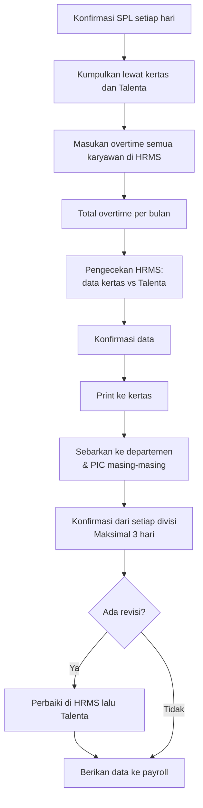
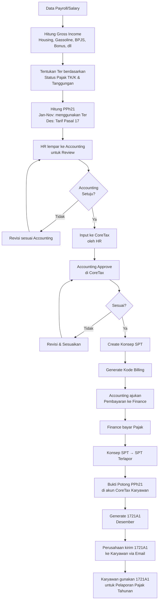

```mermaid
flowchart TD
    A["Konfirmasi SPL setiap hari"] --> B["Kumpulkan lewat kertas dan Talenta"]
    B --> D["Masukan overtime semua karyawan di HRMS"]
    D --> G["Total overtime per bulan"]
    G --> H["Pengecekan HRMS:<br/>data kertas vs Talenta"]
    H --> I["Konfirmasi data"]
    I --> J["Print ke kertas"]
    J --> K["Sebarkan ke departemen<br/>& PIC masing-masing"]
    K --> L["Konfirmasi dari setiap divisi<br/>Maksimal 3 hari"]
    L --> M{Ada revisi?}
    M -->|Ya| N["Perbaiki di HRMS lalu Talenta"]
    N --> O
    M -->|Tidak| O["Berikan data ke payroll"]
```

```mermaid
flowchart TD
    A["Data Payroll/Salary"] --> B["Hitung Gross Income<br/>Housing, Gassoline, BPJS, Bonus, dll"]
    B --> C["Tentukan Ter berdasarkan<br/>Status Pajak TK/K & Tanggungan"]
    C --> D["Hitung PPh21<br/>Jan-Nov: menggunakan Ter<br/>Des: Tarif Pasal 17"]
    D --> E["HR lempar ke Accounting<br/>untuk Review"]
    E --> F{Accounting<br/>Setuju?}
    F -->|Tidak| G["Revisi sesuai Accounting"]
    G --> E
    F -->|Ya| H["Input ke CoreTax<br/>oleh HR"]
    H --> I["Accounting Approve<br/>di CoreTax"]
    I --> J{Sesuai?}
    J -->|Tidak| K["Revisi & Sesuaikan"]
    K --> I
    J -->|Ya| L["Create Konsep SPT"]
    L --> M["Generate Kode Billing"]
    M --> N["Accounting ajukan<br/>Pembayaran ke Finance"]
    N --> O["Finance bayar Pajak"]
    O --> P["Konsep SPT → SPT Terlapor"]
    P --> Q["Bukti Potong PPh21<br/>di akun CoreTax Karyawan"]
    Q --> R["Generate 1721A1<br/>Desember"]
    R --> S["Perusahaan kirim 1721A1<br/>ke Karyawan via Email"]
    S --> T["Karyawan gunakan 1721A1<br/>untuk Pelaporan Pajak Tahunan"]
```