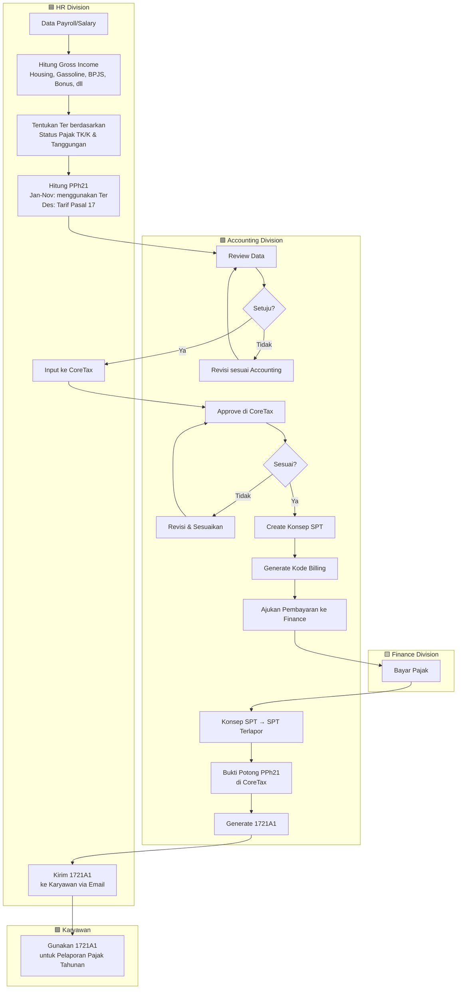

```mermaid
flowchart TD
    subgraph HR["🟦 HR Division"]
        A["Data Payroll/Salary"]
        B["Hitung Gross Income<br/>Housing, Gassoline, BPJS, Bonus, dll"]
        C["Tentukan Ter berdasarkan<br/>Status Pajak TK/K & Tanggungan"]
        D["Hitung PPh21<br/>Jan-Nov: menggunakan Ter<br/>Des: Tarif Pasal 17"]
        H["Input ke CoreTax"]
        S["Kirim 1721A1<br/>ke Karyawan via Email"]
    end
    
    subgraph ACC["🟩 Accounting Division"]
        E["Review Data"]
        F{Setuju?}
        G["Revisi sesuai Accounting"]
        I["Approve di CoreTax"]
        J{Sesuai?}
        K["Revisi & Sesuaikan"]
        L["Create Konsep SPT"]
        M["Generate Kode Billing"]
        N["Ajukan Pembayaran ke Finance"]
        P["Konsep SPT → SPT Terlapor"]
        Q["Bukti Potong PPh21<br/>di CoreTax"]
        R["Generate 1721A1"]
    end
    
    subgraph FIN["🟨 Finance Division"]
        O["Bayar Pajak"]
    end
    
    subgraph EMP["🟪 Karyawan"]
        T["Gunakan 1721A1<br/>untuk Pelaporan Pajak Tahunan"]
    end
    
    A --> B --> C --> D --> E
    E --> F -->|Tidak| G --> E
    F -->|Ya| H --> I
    I --> J -->|Tidak| K --> I
    J -->|Ya| L --> M --> N --> O --> P --> Q --> R --> S --> T
```